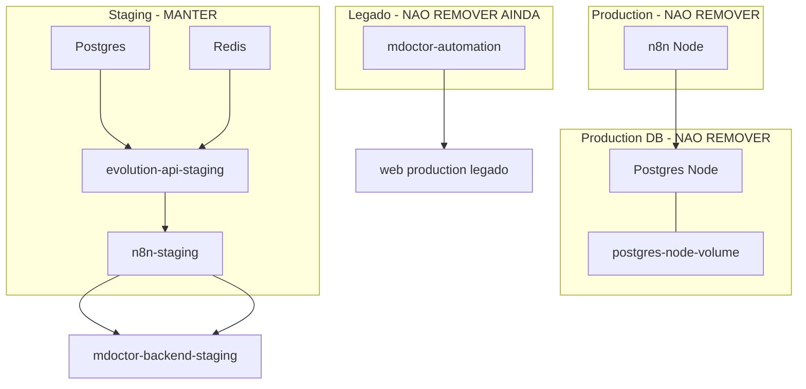

# Organização Railway / n8n — Doctor Prescreve

**Data:** 2026-05-29  
**Modo:** somente leitura — nenhum recurso foi deletado, alterado, redeployado ou migrado.  
**Workspace:** Doctor Markenting's Projects (`e4d69025-145a-4901-98b2-35af61de2fe8`)

---

## 1. Mapeamento de projeto

| Nome no dashboard (legado) | Nome oficial (CLI) | Project ID |
| --- | --- | --- |
| **`N8N - Free`** | **`Automation-MDoctor`** | `fe962e4e-4c41-4c94-9d2d-dbdfe37d0ed4` |

**Regra:** tratar `N8N - Free` = `Automation-MDoctor` em toda documentação e operação.

**Ambientes Railway neste projeto:**

| Ambiente | Environment ID |
| --- | --- |
| `production` | `3e722637-48e4-4fd8-b3f8-efdd753ee874` |
| `staging` | `6c77be19-3b24-46a2-9fc2-4511b920f5aa` |

**Documentos relacionados:** `docs/RAILWAY-INFRA-AUDIT.md`, `docs/RAILWAY-STAGING-RESULTADO.md`, `docs/N8N-STAGING-RUNTIME.md`, `docs/STAGING-FECHAMENTO-GERAL.md`.

---

## 2. Visão rápida: produção vs staging vs legado

| Camada | Produção (vivo) | Staging (oficial de testes) | Legado / suspeito |
| --- | --- | --- | --- |
| n8n | `n8n Node` | `n8n-staging` | — |
| Banco n8n | `Postgres Node` + volume | SQLite efêmero (sem `DATABASE_*` no serviço) | — |
| Banco Evolution | — | `Postgres` + `Redis` | — |
| Proxy automação | — | — | `mdoctor-automation` |
| Backend alvo dos fluxos | `doctor-repositorio-central` / legado (via env n8n prod) | `mdoctor-backend-staging` | `web-production` (via `mdoctor-automation`) |

---

## 3. Inventário detalhado por serviço

Legenda **Pode remover?**: resposta para ação futura, **não** autorizada agora.

### 3.1 Produção — NÃO REMOVER

#### `n8n Node`

| Campo | Valor |
| --- | --- |
| **Service ID** | `07ab35a6-b8d5-4cdc-85ea-2579468ca355` |
| **Ambiente** | `production` |
| **URL pública** | https://n8n-node-production-f844.up.railway.app |
| **Imagem** | `n8nio/n8n` |
| **Função** | n8n **produção** — orquestra Typebot/WhatsApp real, workflows históricos no runtime |
| **Banco usado** | **PostgreSQL** (`DB_TYPE=postgresdb`, `DATABASE_URL` / `DB_POSTGRESDB_*` → proxy Railway `shuttle.proxy.rlwy.net` → `Postgres Node`) |
| **Volume no serviço** | Nenhum (persistência no Postgres dedicado) |
| **Backend chamado** (env, sem alterar) | `BACKEND_URL` → `https://doctor-repositorio-central-…/webhook/triagem` (legado; ver `docs/RAILWAY-INFRA-AUDIT.md`) |
| **Webhooks ativos** | `POST /webhook/typebot-webhook` (principal Typebot prod); demais paths só no runtime n8n (exportar antes de mudar) |
| **Pode remover?** | **Não** |
| **Risco se remover** | Quebra fluxo Typebot/WhatsApp em produção; perda de credenciais/workflows se não houver backup |

#### `Postgres Node`

| Campo | Valor |
| --- | --- |
| **Service ID** | `e6e2059b-1f3c-4af1-9846-b5d41185d085` |
| **Ambiente** | `production` |
| **URL pública** | Nenhuma (acesso interno/proxy) |
| **Função** | Postgres dedicado ao **`n8n Node`** (metadados, credenciais, execuções n8n) |
| **Banco usado** | PostgreSQL 17 (template Railway) |
| **Volume usado** | **`postgres-node-volume`** → `/var/lib/postgresql/data` (~127 MB, `READY`) |
| **Webhooks** | N/A |
| **Pode remover?** | **Não** |
| **Risco se remover** | **Perda total** do n8n produção; irrecuperável sem backup do volume |

#### `postgres-node-volume`

| Campo | Valor |
| --- | --- |
| **Vinculado a** | Serviço `Postgres Node` (production) |
| **Estado** | Montado e em uso (`READY`) |
| **Pode remover?** | **Não** |
| **Risco se remover** | Destruição dos dados do Postgres prod do n8n |

---

### 3.2 Staging — MANTER

#### `n8n-staging`

| Campo | Valor |
| --- | --- |
| **Service ID** | `87ba8406-d695-4f2b-b156-9a14fdebc537` |
| **Ambiente** | `staging` |
| **URL pública** | https://n8n-staging-staging-2dfe.up.railway.app |
| **Imagem** | `n8nio/n8n:latest` |
| **Função** | n8n **staging** — E2E Doctor Prescreve (Typebot + Evolution) |
| **Banco usado** | **SQLite interno** (padrão n8n) — **sem** variáveis `DATABASE_*` no serviço; **sem volume** no serviço |
| **Volume usado** | Nenhum |
| **Backend chamado** | `BACKEND_URL_STAGING` → `https://mdoctor-backend-staging-staging.up.railway.app` |
| **Webhooks ativos** | `POST /webhook/typebot-webhook`, `POST /webhook/evolution-webhook` (probes 200) |
| **Pode remover?** | **Não** (enquanto staging for o ambiente de validação) |
| **Risco se remover** | Para testes E2E, Typebot staging-safe e Evolution staging |

#### `Postgres` (staging)

| Campo | Valor |
| --- | --- |
| **Service ID** | `526f76d8-a686-4127-b1cc-85e4f553b5b1` |
| **Ambiente** | `staging` |
| **Função** | Banco do stack **Evolution API** staging |
| **Volume** | `postgres-volume` → `/var/lib/postgresql/data` (~611 MB) |
| **Webhooks** | N/A |
| **Pode remover?** | **Não** |
| **Risco se remover** | Perda instâncias/sessões Evolution staging |

#### `Redis` (staging)

| Campo | Valor |
| --- | --- |
| **Service ID** | `33b9f4a5-e5d5-476a-909a-419abbc45472` |
| **Ambiente** | `staging` |
| **Função** | Cache/filas do **Evolution API** staging |
| **Volume** | `redis-volume` → `/data` (~150 MB) |
| **Pode remover?** | **Não** |
| **Risco se remover** | Evolution staging instável |

#### `evolution-api-staging` (contexto — mesmo projeto)

| Campo | Valor |
| --- | --- |
| **Service ID** | `ab310799-fef4-4f28-8ecf-bdd2c0fa0aaf` |
| **Ambiente** | `staging` |
| **URL** | https://evolution-api-staging-staging-40d1.up.railway.app |
| **Função** | WhatsApp staging (`mdoctor-staging`) → webhook n8n `evolution-webhook` |
| **Banco** | Usa `Postgres` + `Redis` staging |
| **Pode remover?** | **Não** (parte do E2E staging) |

---

### 3.3 Suspeito / legado — NÃO REMOVER AINDA

#### `mdoctor-automation`

| Campo | Valor |
| --- | --- |
| **Service ID** | `8b8a37ef-dd5b-432e-b642-f0d770f9478a` |
| **Ambiente** | `production` apenas (não deploy em staging) |
| **URL pública** | https://mdoctor-automation-production.up.railway.app |
| **Função** | Proxy Express: encaminha webhooks para backend legado |
| **Banco usado** | Nenhum |
| **Volume** | Nenhum |
| **Backend chamado** | `BACKEND_URL` → `https://web-production-5f178.up.railway.app` (backend legado `web`) |
| **Webhooks expostos** | `POST /webhook/whatsapp`, `POST /webhook/decisao`, `POST /webhook/test`; `GET /healthz`, `GET /readyz` |
| **Pode remover?** | **Não agora** — candidato a arquivar **depois** (P3) |
| **Risco se remover** | Médio: se integrador externo (Z-API, Twilio, fluxo antigo) ainda apontar para esta URL |

**Evidências de uso (somente leitura):**

| Fonte | Achado |
| --- | --- |
| Repositório | **Nenhuma** referência à URL `mdoctor-automation-production` fora de docs |
| Workflows Git (`docs/n8n-workflows/`) | **Não** referenciam `mdoctor-automation` |
| n8n produção | Fluxo principal é **`n8n Node`**, não este serviço |
| Probe HTTP | `GET /healthz` → 200; `GET /readyz` → 503 (backend legado inacessível no check); `POST /webhook/whatsapp` sem secret → 503 |
| Código | `mdoctor-automation/server.js` — encaminha para `/api/whatsapp/webhook` no `BACKEND_URL` |

**Conclusão:** serviço **online** mas **provavelmente superseded** pelo `n8n Node` + staging stack. Confirmar tráfego real (métricas Railway / logs) antes de arquivar (P3).

---

## 4. Matriz de decisão

| Recurso | Manter agora | Não remover | Candidato a arquivar depois | Precisa migrar depois | Pendência crítica |
| --- | :---: | :---: | :---: | :---: | :---: |
| `n8n Node` | ✅ | ✅ | | | |
| `Postgres Node` | ✅ | ✅ | | | |
| `postgres-node-volume` | ✅ | ✅ | | | |
| `n8n-staging` | ✅ | ✅ | | ✅ (Postgres persistente — P2) | SQLite efêmero |
| `Postgres` (staging) | ✅ | ✅ | | | |
| `Redis` (staging) | ✅ | ✅ | | | |
| `evolution-api-staging` | ✅ | ✅ | | | |
| `mdoctor-automation` | ✅ | ✅ | ✅ (P3) | | Confirmar tráfego |
| Workflows n8n prod (runtime) | ✅ | ✅ | | ✅ (exportar para Git) | Só no runtime |
| Typebot cloud (publicado) | ✅ | ✅ | | ✅ (publicar staging-safe) | `TYPEBOT_API_TOKEN` |

---

## 5. Webhooks: quem usa o quê

### 5.1 Usam `n8n Node` (produção)

| Consumidor | Webhook / URL | Evidência |
| --- | --- | --- |
| **Typebot cloud (export legado)** | `https://n8n-node-production-f844.up.railway.app/webhook/typebot-webhook` | `docs/TYPEBOT-STAGING-HARDENING.md` — achado no export original antes do patch |
| **Typebot publicado em produção** (se ainda não republicado) | Mesmo URL acima | Risco: bot cloud pode ainda apontar para prod |
| **Runtime `n8n Node`** | `WEBHOOK_URL` = base `n8n-node-production-f844…`; path `typebot-webhook` | Variáveis Railway (nome apenas; não alteradas nesta auditoria) |
| **Workflows n8n prod** | Paths definidos no editor n8n (não versionados no Git) | `docs/RAILWAY-INFRA-AUDIT.md` — exportar antes de qualquer mudança |

**Não usar em staging:** scripts validam ausência de `n8n-node-production` no JSON staging-safe (`validate-typebot-staging-safe.js`).

### 5.2 Usam `n8n-staging`

| Consumidor | Webhook / URL | Evidência |
| --- | --- | --- |
| **Typebot staging-safe (repo)** | `https://n8n-staging-staging-2dfe.up.railway.app/webhook/typebot-webhook` | `typebot-doctor-prescreve-staging-safe.json`, `patch-typebot-reorganize.js` |
| **Evolution API staging** | `https://n8n-staging-staging-2dfe.up.railway.app/webhook/evolution-webhook` | `docs/EVOLUTION-API-STAGING.md` |
| **Workflows Git** | `typebot-webhook-staging`, `evolution-webhook-staging`, `clinical-rejection-notify-staging` | `docs/n8n-workflows/*.json` |
| **Scripts E2E / smoke** | Mesmas URLs | `e2e-typebot-n8n-evolution-staging.js`, `staging-e2e-operacional.js`, etc. |
| **n8n staging (menu WhatsApp)** | Encaminha para `N8N_TYPEBOT_WEBHOOK_URL` (mesmo host staging) | `lib/whatsapp-inbound-menu.code.js` |

### 5.3 `mdoctor-automation` — chamadores conhecidos

| Consumidor | Endpoint | Evidência no repo |
| --- | --- | --- |
| **Nenhum confirmado em código ativo** | `https://mdoctor-automation-production.up.railway.app/webhook/*` | Ausência de URL hardcoded fora de docs |
| **Teste manual** | `/webhook/whatsapp` | `mdoctor-automation/test-webhook.js` |
| **Fluxos legados (formato n8n)** | `whatsapp-flow.json`, `whatsapp-router.json` | `mdoctor-automation/flows/` — espelham padrão n8n; não provam tráfego prod |

**Ação futura (P3):** inspecionar métricas/logs Railway 7–30 dias em `/webhook/whatsapp` e `/webhook/decisao` antes de arquivar.

---

## 6. Backends chamados por serviço

| Serviço | Variável / mecanismo | Backend destino | Observação |
| --- | --- | --- | --- |
| `n8n Node` | `BACKEND_URL` | `doctor-repositorio-central` (legado) | Produção; diverge do backend `web` |
| `n8n-staging` | `BACKEND_URL_STAGING` | `mdoctor-backend-staging-staging.up.railway.app` | Oficial staging |
| `n8n-staging` workflows | HTTP node / Code | `…/api/whatsapp/webhook` | Com `X-MDoctor-Webhook-Secret` |
| `mdoctor-automation` | `BACKEND_URL` | `web-production-5f178.up.railway.app` | Backend legado `web` |
| `evolution-api-staging` | — | Postgres/Redis internos | Não chama n8n diretamente no DB |

**Mapa de backends Railway (ecossistema completo):**

| Papel | URL |
| --- | --- |
| Backend staging oficial | https://mdoctor-backend-staging-staging.up.railway.app |
| Backend produção legado | https://web-production-5f178.up.railway.app |
| Backend legado (n8n prod env) | `doctor-repositorio-central` (host Railway legado) |

---

## 7. URLs hardcoded — Typebot e n8n (repositório)

### 7.1 Typebot

| Arquivo | URL n8n / webhook | Ambiente |
| --- | --- | --- |
| `docs/typebot/typebot-doctor-prescreve-staging-safe.json` | `https://n8n-staging-staging-2dfe.up.railway.app/webhook/typebot-webhook` | Staging |
| `docs/typebot/typebot-export-doctor-prescreve-8rmljgu (5).json` | **Atualizado** para staging-safe (mesmo webhook staging) | Staging (após patch) |
| Export **original** (histórico em `TYPEBOT-STAGING-HARDENING.md`) | `https://n8n-node-production-f844.up.railway.app/webhook/typebot-webhook` | Produção — **não** usar em staging |

**Outras URLs no Typebot (não n8n):** links LGPD institucionais (`doctorprescreve.com.br`), blocos de pagamento Typebot (`credentialsId` em cloud).

### 7.2 n8n — workflows versionados (Git)

| Arquivo | URL hardcoded (fallback) |
| --- | --- |
| `docs/n8n-workflows/typebot-webhook-staging.json` | `BACKEND_URL_STAGING` ou `https://mdoctor-backend-staging-staging.up.railway.app` |
| `docs/n8n-workflows/evolution-webhook-staging.json` | `BACKEND_URL_STAGING`, Evolution staging URL, `N8N_TYPEBOT_WEBHOOK_URL` |
| `docs/n8n-workflows/lib/whatsapp-inbound-menu.code.js` | `https://n8n-staging-staging-2dfe.up.railway.app/webhook/typebot-webhook` |

**Produção:** não há JSON de workflows n8n prod no Git — estado **só no runtime** `n8n Node`.

### 7.3 Scripts backend (defaults staging)

| Script | Default n8n |
| --- | --- |
| `mdoctor-backend/scripts/deploy-n8n-workflow.js` | `n8n-staging-staging-2dfe…` |
| `mdoctor-backend/scripts/validate-typebot-staging-safe.js` | Exige staging; **proíbe** `n8n-node-production` |
| `mdoctor-backend/scripts/staging-e2e-operacional.js` | Webhook staging |

---

## 8. O que NÃO pode apagar

| Item | Motivo |
| --- | --- |
| `n8n Node` | n8n produção ativo |
| `Postgres Node` | Banco do n8n prod (**não está removido** na API — `SUCCESS`) |
| `postgres-node-volume` | Única persistência do Postgres prod |
| `n8n-staging` | Fluxo staging/E2E atual |
| `Postgres` + `Redis` staging | Dependências Evolution staging |
| `evolution-api-staging` | WhatsApp staging conectado |

---

## 9. O que pode ser arquivado futuramente (sem executar agora)

| Item | Pré-requisito |
| --- | --- |
| `mdoctor-automation` | Zero tráfego em logs 30d; confirmar que Typebot/Evolution/n8n não apontam para a URL |
| Workflows duplicados no `n8n Node` | Export completo para `docs/n8n-workflows/production/` e validação |
| Projeto `Memory-Mdoctor` (outro Railway project) | Confirmar que nenhum serviço usa seu Redis |

---

## 10. Plano futuro (não executado)

### P1 — Fechar staging operacional (sem tocar produção)

1. Publicar Typebot staging-safe na cloud (`TYPEBOT_API_TOKEN` + `publish-typebot-staging.js`).
2. Republicar workflows n8n staging via API (`N8N_API_KEY` + `deploy-n8n-workflow.js` / `staging-deploy-2-2.js`).
3. Finalizar smoke: `staging-e2e-operacional.js`, E2E Evolution manual.
4. Confirmar webhook Typebot cloud = **staging**, nunca `n8n-node-production`.

**Critério de pronto:** Typebot cloud → `n8n-staging` → backend staging → painel staging.

### P2 — Persistência n8n staging

1. Criar/usar Postgres dedicado para `n8n-staging` (referência Railway ao serviço `Postgres` staging ou novo serviço só n8n).
2. Configurar `DB_TYPE=postgresdb` + `DATABASE_URL` **somente em staging** (requer autorização explícita para alterar vars).
3. Migrar dados SQLite → Postgres (backup export n8n antes).
4. Redeploy **apenas** `n8n-staging` após autorização.

**Benefício:** workflows/credenciais sobrevivem a redeploy.

### P3 — Validar e arquivar `mdoctor-automation`

1. Métricas/logs: `whatsappReceived`, rotas `/webhook/*`.
2. Se tráfego zero: marcar como deprecated, documentar substituto (`n8n Node` prod / `n8n-staging`).
3. Arquivar serviço (stop deploy) — **não delete** até período de observação.

### P4 — Padronizar nomes Railway (cosmético, baixo risco)

| Nome atual | Nome proposto |
| --- | --- |
| `n8n Node` | `n8n-production` |
| `Postgres Node` | `postgres-automation-production` |
| `Postgres` (staging) | `postgres-evolution-staging` |
| `n8n-staging` | manter ou `n8n-staging` (já claro) |

Renomear **não** muda URLs Railway geradas automaticamente; planejar comunicação de URLs se recriar serviços.

---

## 11. Restrições desta ordem (cumpridas)

- [x] Não deletar serviços nem volumes  
- [x] Não alterar produção  
- [x] Não alterar secrets / variáveis  
- [x] Não redeployar  
- [x] Apenas mapear, nomear, documentar e plano  

---

## 12. Próximos passos seguros (checklist operador)

1. **Ler** este doc + `docs/STAGING-FECHAMENTO-GERAL.md` antes de qualquer mudança.
2. **P1:** obter `TYPEBOT_API_TOKEN` e `N8N_API_KEY` (somente em ambiente seguro, não commitar).
3. **Validar** Typebot cloud aponta para webhook **staging**.
4. **Nunca** remover `Postgres Node` / volume pensando que está “órfão” — está **ativo**.
5. **P2/P3/P4:** só após aprovação explícita e janela de manutenção.

---

## 13. Resumo executivo

| Pergunta | Resposta |
| --- | --- |
| O que é produção? | `n8n Node` + `Postgres Node` + `postgres-node-volume` |
| O que é staging? | `n8n-staging`, `Postgres`, `Redis`, `evolution-api-staging` |
| O que é legado? | `mdoctor-automation` (prod, proxy para `web-production`) |
| n8n ativo para testes Doctor Prescreve? | **`n8n-staging`** |
| n8n ativo para produção real? | **`n8n Node`** |
| Pode apagar volume Postgres Node? | **Não** |
| Maior pendência staging? | Publicar Typebot + republicar n8n + Postgres persistente para `n8n-staging` |

*Gerado por auditoria read-only Railway CLI + inventário do repositório. Para detalhes de workspace completo, ver `docs/RAILWAY-INFRA-AUDIT.md`.*
