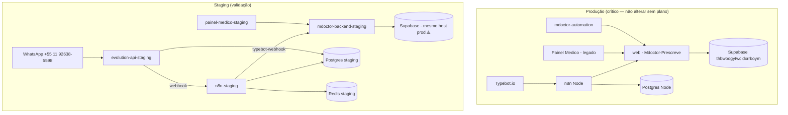

# Auditoria de Infraestrutura Railway — Doctor Prescreve

Data/hora: 2026-05-29 — leitura **somente** (nenhum recurso removido ou alterado).

Workspace: **Doctor Markenting's Projects** (`e4d69025-145a-4901-98b2-35af61de2fe8`)

Repositório oficial alvo (código): `MMax-Company/Plataforma-Medica-Mdoctor`  
Repositório legado (ainda em produção Railway): `MMax-Company/Mdoctor-Prescreve`

---

## 1. Inventário completo de projetos e serviços

### Visão por projeto

| Projeto | ID | Ambientes | Serviços no catálogo | Deploy ativos |
| --- | --- | --- | --- | --- |
| **Automation-MDoctor** | `fe962e4e-4c41-4c94-9d2d-dbdfe37d0ed4` | `production`, `staging` | 7 | 3 prod + 4 staging |
| **Backend-Mdoctor** | `bed0e3b3-fa4b-4bc2-a7fb-dcabca09cd9b` | `production`, `staging` | 2 | 1 prod + 1 staging |
| **Painel-MDoctor** | `3bec26a7-422e-40ae-8763-2a4c5158fef4` | `production`, `staging` | 2 | 1 prod + 1 staging |
| **Memory-Mdoctor** | `e4eff7cf-5d9c-439b-bd4d-d5b86fb6db11` | `production` apenas | 1 | 1 (Redis) |

### Matriz serviço × ambiente (deploy real)

Legenda: ✅ `SUCCESS` / ⬜ não implantado neste ambiente

#### Automation-MDoctor

| Serviço | Service ID | production | staging | Finalidade |
| --- | --- | --- | --- | --- |
| **n8n Node** | `07ab35a6-…` | ✅ | ⬜ | n8n **produção** — workflows Typebot/WhatsApp reais |
| **mdoctor-automation** | `8b8a37ef-…` | ✅ | ⬜ | Serviço auxiliar de automação (health `/healthz`) |
| **Postgres Node** | `e6e2059b-…` | ✅ | ⬜ | Postgres dedicado ao stack n8n **produção** |
| **n8n-staging** | `87ba8406-…` | ⬜ | ✅ | n8n **staging** — webhooks Evolution/Typebot |
| **evolution-api-staging** | `ab310799-…` | ⬜ | ✅ | Evolution API WhatsApp (instância `mdoctor-staging`) |
| **Postgres** | `526f76d8-…` | ⬜ | ✅ | Postgres do stack **staging** (n8n/Evolution) |
| **Redis** | `33b9f4a5-…` | ⬜ | ✅ | Redis do stack **staging** |

#### Backend-Mdoctor

| Serviço | Service ID | production | staging | Finalidade |
| --- | --- | --- | --- | --- |
| **web** | `f5569fee-…` | ✅ | ⬜ | Backend **produção legado** (`Mdoctor-Prescreve`) |
| **mdoctor-backend-staging** | `53960eb4-…` | ⬜ | ✅ | Backend **staging oficial** (`Plataforma-Medica-Mdoctor`) |

#### Painel-MDoctor

| Serviço | Service ID | production | staging | Finalidade |
| --- | --- | --- | --- | --- |
| **Painel Medico** | `e9bca6ab-…` | ✅ | ⬜ | Frontend **produção legado** |
| **painel-medico-staging** | `626fc9d2-…` | ⬜ | ✅ | Frontend **staging oficial** |

#### Memory-Mdoctor

| Serviço | Service ID | production | Finalidade |
| --- | --- | --- | --- |
| **Redis** | `16b6a346-…` | ✅ | Redis isolado — **sem app consumidor visível** no mesmo projeto |

---

## 2. URLs públicas e healthchecks

| Papel | Serviço Railway | URL pública | Healthcheck sugerido |
| --- | --- | --- | --- |
| Backend produção (legado) | `Backend-Mdoctor` / `web` | `https://web-production-5f178.up.railway.app` | `GET /health` |
| Backend staging (oficial) | `mdoctor-backend-staging` | `https://mdoctor-backend-staging-staging.up.railway.app` | `GET /health`, `GET /readyz` |
| Painel produção (legado) | `Painel Medico` | `https://web-production-02fde.up.railway.app` | `GET /login` |
| Painel staging (oficial) | `painel-medico-staging` | `https://painel-medico-staging-staging.up.railway.app` | `GET /dashboard` |
| n8n produção | `n8n Node` | `https://n8n-node-production-f844.up.railway.app` | UI + `POST /webhook/typebot-webhook` |
| n8n staging | `n8n-staging` | `https://n8n-staging-staging-2dfe.up.railway.app` | `POST /webhook/typebot-webhook`, `POST /webhook/evolution-webhook` |
| Evolution staging | `evolution-api-staging` | `https://evolution-api-staging-staging-40d1.up.railway.app` | `GET /`, manager `/manager` |
| Automação produção | `mdoctor-automation` | `https://mdoctor-automation-production.up.railway.app` (domínio Railway gerado) | `GET /healthz` |

Observação: URLs com sufixo duplo `-staging-staging` vêm do nome do serviço + nome do ambiente Railway — padronizar nomes reduz confusão.

---

## 3. Repositórios e branches (estado documentado)

| Serviço | Repo atual (confirmado em docs/CLI) | Repo alvo | Root directory alvo |
| --- | --- | --- | --- |
| `web` | `Plataforma-Medica-Mdoctor` (branch `codex/legacy-compat-infra`, migrado 2026-05-29) | — | `mdoctor-backend` |
| `Painel Medico` | `MMax-Company/Mdoctor-Prescreve` | `Plataforma-Medica-Mdoctor` | `mdoctor-panel` |
| `mdoctor-backend-staging` | `Plataforma-Medica-Mdoctor` (branch `codex/legacy-compat-infra`) | — | `mdoctor-backend` |
| `painel-medico-staging` | `Plataforma-Medica-Mdoctor` | — | `mdoctor-panel` |
| `mdoctor-automation` | não confirmado na API | `Plataforma-Medica-Mdoctor` | `mdoctor-automation` |
| `n8n Node` / `n8n-staging` | imagem Docker / template n8n (sem repo app) | workflows versionados em `docs/n8n-workflows/` | — |
| `evolution-api-staging` | imagem `evoapicloud/evolution-api` | — | — |
| Postgres / Redis | templates Railway | — | — |

Branch Git recomendada:

| Ambiente | Branch |
| --- | --- |
| **production** | `main` (após migração validada) |
| **staging** | `codex/legacy-compat-infra` ou `staging` dedicada |
| **desenvolvimento** | feature branches → PR → staging |

---

## 4. Variáveis principais (somente nomes — sem valores)

### 4.1 Conflitos e acoplamentos críticos

| Achado | Severidade | Detalhe |
| --- | --- | --- |
| **Mesmo Supabase em prod e staging** | 🔴 Alta | `web` (prod) e `mdoctor-backend-staging` usam o mesmo host Supabase (`thbwoogytwcidxrrboym`). Risco de dados de teste em base produtiva. |
| **Três URLs de backend no ecossistema n8n** | 🟠 Média | `n8n Node` → `doctor-repositorio-central`; `mdoctor-automation` → `web-production`; staging → `mdoctor-backend-staging`. |
| **CORS inconsistente** | 🟠 Média | Backend staging com `CORS_ORIGIN=*`; produção com CORS apontando para URL do painel legado. |
| **Memed ativo no n8n produção** | 🟠 Média | `MEMED_ENABLED=true` / `MEMED_ENVIRONMENT=production` no `n8n Node` — fora do padrão “Memed só no backend”. |
| **Stripe test keys em produção Railway** | 🟡 Baixa | Chaves `pk_test_` / `sk_test_` em serviços prod (não é produção financeira real, mas nomenclatura confusa). |
| **Secrets espalhados** | 🔴 Alta | Mesmas famílias (`MEMED_*`, `STRIPE_*`, `SUPABASE_*`, `N8N_ENCRYPTION_KEY`) repetidas em 4+ serviços sem vault central. |

### 4.2 Mapa resumido por serviço ativo

**n8n Node (production):** `N8N_*`, `WEBHOOK_URL`, `BACKEND_URL`, `DATABASE_URL`, `SUPABASE_*`, `MEMED_*`, `STRIPE_*`, `TYPEBOT_URL`, `WHATSAPP_*`, `ZAPI_URL`

**n8n-staging:** `FLOW_ENV`, `BACKEND_URL_STAGING`, `N8N_WEBHOOK_SECRET`, `N8N_TYPEBOT_WEBHOOK_URL`, `EVOLUTION_INSTANCE`, `N8N_WORKFLOW_NAME*`

**mdoctor-backend-staging:** `NODE_ENV`, `ENVIRONMENT_NAME`, `WHATSAPP_PROVIDER`, `WHATSAPP_DRY_RUN`, `WHATSAPP_SANDBOX_MODE`, `EVOLUTION_*`, `N8N_WEBHOOK_SECRET`, `SUPABASE_*`, `LEGACY_COMPAT_*`, `MEMED_*` (mock)

**web (production):** `NODE_ENV=production`, `MEMED_*` (produção), `STRIPE_*`, `SUPABASE_*`, `CORS_ORIGIN`

**painel-medico-staging:** `NEXT_PUBLIC_API_URL`, `NEXT_PUBLIC_APP_ENV=staging`, `NEXT_PUBLIC_ENABLE_MOCK_FALLBACK`

**evolution-api-staging:** `SERVER_URL`, `DATABASE_*`, volume `/evolution/instances`, `AUTHENTICATION_API_KEY` (secret)

---

## 5. Dependências e fluxo atual



---

## 6. Problemas identificados

### 6.1 Serviços órfãos ou suspeitos

| Item | Evidência | Recomendação |
| --- | --- | --- |
| **Memory-Mdoctor / Redis** | Projeto separado, só Redis, sem app no mesmo projeto | **Arquivar** após confirmar que nenhum serviço referencia `REDIS_URL` deste projeto |
| **mdoctor-automation (prod)** | Poucas envs; `BACKEND_URL` → backend legado | **Manter** até mapear workflows; depois fundir ou documentar dono |
| **Postgres + Redis (Automation staging)** | Sem serviço “app” além de n8n/Evolution | **Manter** — são dependências válidas do stack staging |

### 6.2 Duplicações

| Duplicação | Oficial proposto | Legado / redundante |
| --- | --- | --- |
| Backend | `mdoctor-backend-staging` → futuro `mdoctor-backend-production` | `web` |
| Painel | `painel-medico-staging` → futuro `painel-medico-production` | `Painel Medico` |
| n8n | `n8n-staging` (testes) / `n8n Node` (prod) | — (dois necessários, **renomear** para `n8n-production`) |
| Postgres | `Postgres` (staging stack) / `Postgres Node` (prod stack) | — (renomear: `postgres-automation-staging` / `postgres-automation-production`) |
| Redis | `Redis` em Automation staging | `Memory-Mdoctor/Redis` → candidato remoção |
| Webhooks Typebot | `…/webhook/typebot-webhook` staging | `n8n-node-production-…/webhook/typebot-webhook` (prod) |

### 6.3 Ambientes confusos

- Um **mesmo catálogo de 7 serviços** em Automation-MDoctor aparece nos dois ambientes, mas só um subconjunto implanta em cada — gera sensação de “serviço fantasma” no dashboard.
- Nome `evolution-api-staging` no projeto com env `production` vazio: não é bug, mas **nome enganoso** no UI.

### 6.4 Workflows n8n sem padronização

| Estado | Onde |
| --- | --- |
| ✅ Versionados no Git | `docs/n8n-workflows/evolution-webhook-staging.json`, `typebot-webhook-staging.json`, `doctor-prescreve-staging-safe.json` |
| ⚠️ Só no runtime | Workflows históricos em `n8n Node` (produção) — exportar e comparar |
| ⚠️ Resposta HTTP vazia | Webhooks staging retornam `200` com body vazio; lógica OK, UX de debug ruim |

Padronização proposta: prefixo `dp-<env>-<fluxo>` (ex.: `dp-staging-typebot-webhook`), variáveis `FLOW_ENV`, `BACKEND_URL_<ENV>`, deploy via `scripts/n8n-activate-workflow.js`.

---

## 7. Arquitetura oficial proposta

### 7.1 Produção (alvo — após migração aprovada)

| Camada | Serviço Railway oficial | Projeto sugerido |
| --- | --- | --- |
| Backend | `mdoctor-backend` (renomear de `web`) | `Backend-Mdoctor` |
| Frontend | `mdoctor-panel` (renomear de `Painel Medico`) | `Painel-MDoctor` |
| n8n | `n8n-production` (renomear de `n8n Node`) | `Automation-MDoctor` |
| Automação | `mdoctor-automation` | `Automation-MDoctor` |
| WhatsApp API | *(futuro)* `evolution-api-production` ou Cloud API | `Automation-MDoctor` |
| DB automação | `postgres-automation-production` | `Automation-MDoctor` |
| Dados clínicos | **Supabase projeto produção** (dedicado) | externo |

### 7.2 Staging (atual — referência estável)

| Camada | Serviço atual |
| --- | --- |
| Backend | `mdoctor-backend-staging` |
| Frontend | `painel-medico-staging` |
| n8n | `n8n-staging` |
| Evolution | `evolution-api-staging` |
| DB automação | `Postgres` + `Redis` (staging) |
| Dados clínicos | **Criar Supabase staging separado** (migrar de `thbwoogytwcidxrrboym`) |

### 7.3 O que não criar agora

- Novos projetos Railway (usar os 3 existentes + consolidar `Memory-Mdoctor`).
- Novo serviço n8n/Evolution em produção até staging E2E estável e Typebot publicado.

---

## 8. Padronização recomendada

### Nomes de serviços (convenção)

```
<produto>-<componente>-<ambiente opcional>
```

Exemplos: `mdoctor-backend-staging`, `n8n-production`, `evolution-api-staging`, `postgres-automation-staging`.

### Variáveis (convenção)

| Variável | Escopo |
| --- | --- |
| `ENVIRONMENT_NAME` | `production` \| `staging` |
| `NODE_ENV` | alinhado ao ambiente |
| `BASE_URL` | URL pública do próprio serviço |
| `BACKEND_URL` / `BACKEND_URL_STAGING` | unificar em `BACKEND_URL` por ambiente |
| `N8N_WEBHOOK_SECRET` | mesmo valor staging backend + n8n staging |
| `FLOW_ENV` | só n8n — deve bater com `ENVIRONMENT_NAME` |
| Secrets Memed/Stripe | **apenas** no backend oficial do ambiente |

### Healthchecks Railway

| Serviço | Path | Intervalo |
| --- | --- | --- |
| Backend | `/health` | 30s |
| Backend (deep) | `/readyz` | manual / monitor externo |
| Painel | `/login` | 60s |
| mdoctor-automation | `/healthz` | 60s |
| Evolution | `/` | 60s |

---

## 9. Plano de disposição (requer sua aprovação)

### ✅ Manter (estável)

| Recurso | Motivo |
| --- | --- |
| `web` + `Painel Medico` | Produção ativa legada — **não remover** até migração |
| `mdoctor-backend-staging` + `painel-medico-staging` | Stack oficial de validação |
| `n8n-staging` + `evolution-api-staging` + Postgres/Redis staging | Integração WhatsApp E2E |
| `n8n Node` + `Postgres Node` + `mdoctor-automation` | Automação produção atual |
| Volume Evolution `/evolution/instances` | Sessão WhatsApp staging |

### 📦 Arquivar (desligar depois de confirmação)

| Recurso | Condição para arquivar |
| --- | --- |
| **Memory-Mdoctor** (projeto inteiro) | Confirmar zero referências em envs |
| Workflows n8n duplicados inativos | Após export JSON para `docs/n8n-workflows/` |
| Deployments antigos | Limpeza via Railway UI (não afeta runtime) |

### 🗑️ Remover (somente com OK explícito)

| Recurso | Risco |
| --- | --- |
| Serviços `NOT_DEPLOYED` fantasma | Baixo — já não rodam |
| Instâncias n8n duplicadas criadas em testes | Médio — validar webhook ativo antes |
| Redis Memory-Mdoctor | Baixo se órfão |

### 🔄 Migrar

| De | Para | Prioridade |
| --- | --- | --- |
| `Mdoctor-Prescreve` → `Plataforma-Medica-Mdoctor` em `web` | Branch `main`, root `mdoctor-backend` | P1 — após janela de manutenção |
| `Mdoctor-Prescreve` → `mdoctor-panel` em `Painel Medico` | Idem | P1 |
| Supabase compartilhado | Projeto Supabase **staging** isolado | P0 — segurança de dados |
| `BACKEND_URL` do `n8n Node` | URL do backend oficial pós-migração | P2 |
| Webhook Typebot produção | Manter prod; staging já isolado | P2 |
| Secrets para Railway Shared Variables / 1Password | Governança | P1 |

---

## 10. Ordem de execução sugerida (governança)

1. **P0 — Segurança de dados:** criar Supabase staging; apontar `mdoctor-backend-staging`; nunca testar com CPF real em base prod.
2. **P0 — Inventário n8n produção:** exportar todos os workflows `n8n Node` → `docs/n8n-workflows/production/`.
3. **P1 — Renomear** serviços (sem mudar URLs Railway geradas — aceitar ou recriar domínio).
4. **P1 — Unificar variáveis** `BACKEND_URL` / `CORS_ORIGIN` por ambiente.
5. **P2 — Migração repo** `web` e `Painel Medico` (um serviço por vez, checklist em `docs/TRANSICAO-RAILWAY-GITHUB.md`).
6. **P3 — Consolidar projetos:** absorver `Memory-Mdoctor` ou documentar uso.
7. **P3 — Evolution produção:** só após staging sem dry-run e política anti-spam validada.

---

## 11. Ferramentas de auditoria contínua

Script read-only adicionado ao repo:

```bash
node scripts/railway-infra-audit.js > scripts/railway-audit-output.json
```

Requer `railway login`. Não grava secrets — complementar com `railway variable list` por serviço para revisões.

---

## 12. Resumo executivo

| Métrica | Valor |
| --- | --- |
| Projetos Railway | 4 |
| Serviços catalogados | 12 |
| Deployments ativos | 10 |
| Stacks distintos | Prod legado, Staging oficial, Automação prod, Automação staging |
| Maior risco | **Supabase compartilhado** entre staging e produção |
| Maior confusão | Nomes (`web`, `n8n Node`, `*-staging-staging` URLs) |
| Produção tocada nesta auditoria | **Não** |

**Nenhum recurso foi deletado ou alterado.** Próximo passo recomendado: sua aprovação do plano P0 (Supabase staging isolado) e P1 (export workflows n8n produção).
