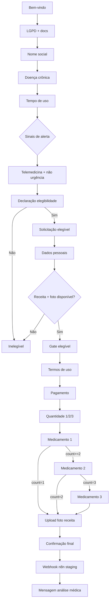

# Typebot Doctor Prescreve — fluxo reorganizado

## Identificação (não alterar)

| Campo | Valor |
|-------|--------|
| `publicId` | `doctor-prescreve-8rmljgu` |
| `id` interno | `higij2z0xihxxkr378rmljgu` |
| Ambiente de trabalho | **staging** (sem URLs de produção no export) |

## Arquivos

| Arquivo | Descrição |
|---------|-----------|
| `docs/typebot/typebot-doctor-prescreve-staging-safe.json` | Export principal patcheado |
| `docs/typebot/typebot-export-doctor-prescreve-8rmljgu (5).json` | Espelho do export oficial |
| `mdoctor-backend/scripts/patch-typebot-reorganize.js` | Reorganização completa do fluxo |
| `mdoctor-backend/scripts/typebot-documents.js` | URLs oficiais + links amigáveis (constante `DOCUMENTS`) |
| `mdoctor-backend/scripts/patch-typebot-eligibility.js` | Alias → `patch-typebot-reorganize.js` |
| `mdoctor-backend/scripts/validate-typebot-staging-safe.js` | Valida JSON, webhook e ordem do fluxo |
| `docs/n8n-workflows/lib/typebot-webhook-payload.code.js` | Normalização n8n → backend |

## Ordem do fluxo (após reorganização)



### Pontos críticos

1. **Elegibilidade antes do pagamento** — LGPD, protocolo, tempo ≥ 30 dias, sinais de alerta, declaração, confirmação de receita anterior **e foto disponível** (sem upload ainda).
2. **Pagamento** — só após triagem mínima; paciente inelegível **não** chega ao pagamento.
3. **Medicamentos** — coleta detalhada **após** pagamento; variáveis separadas por slot (`med1_*`, `med2_*`, `med3_*`).
4. **Upload da receita** — grupo **ENVIO DA RECEITA ANTERIOR**, `file input` obrigatório, variável `previous_prescription_file`.
5. **Webhook** — após confirmação final; URL staging única.

## Bloqueios antes do pagamento

- LGPD não autorizado → Group #22  
- Tempo de uso &lt; 30 dias → Tratamento Menor 30 dias  
- Sinais de alerta → Sinal alerta identificado  
- Declaração de elegibilidade negativa → Não elegível  
- Sem receita anterior ou sem foto disponível → Inelegível presencial  

**Mensagem padrão:**

> Pelas informações fornecidas, não será possível seguir com a renovação por teleconsulta neste momento. Recomendamos atendimento médico presencial para melhor avaliação.

## Variáveis principais

| Variável | Uso |
|----------|-----|
| `Nome_Completo`, `data_nascimento`, `cpf_paciente`, `whatsapp`, `Email`, `Endereco`, `cep` | Dados pessoais |
| `doenca_cronica`, `tempo_uso`, `continuous_use_days` | Triagem clínica |
| `sinais_alerta`, `has_warning_signs` | Alertas |
| `eligibility_status`, `ineligibility_reason` | Elegibilidade |
| `has_previous_prescription`, `has_prescription_photo_ready` | Receita (pré-pagamento) |
| `medication_count` | 1, 2 ou 3 |
| `med1_nome` … `med3_via` | Medicamentos estruturados |
| `previous_prescription_file` | Upload pós-pagamento |
| `payment_status` | Enviado como `paid` no webhook após pagamento |

Data de nascimento: aceita `dd/mm/aaaa`, `ddmmaaaa`, `d/m/aaaa` — normalizada no n8n/backend.

## Webhook (staging)

```
https://n8n-staging-staging-2dfe.up.railway.app/webhook/typebot-webhook
```

Campos no body (resumo): `patient_name`, `birth_date`, `cpf`, `whatsapp`, `email`, `address`, `cep`, `chronic_condition`, `continuous_use_days`, `has_warning_signs`, `eligibility_status`, `ineligibility_reason`, `medication_count`, `medication_1_*` … `medication_3_*`, `has_previous_prescription`, `has_prescription_photo_ready`, `previous_prescription_file`, `payment_status`, `protocol`, `source`.

- `protocol`: `staging-clinical-v1`  
- `source`: `typebot-doctor-prescreve`  

## Comandos

```bash
# Reaplicar reorganização
node mdoctor-backend/scripts/patch-typebot-reorganize.js

# Validar export
node mdoctor-backend/scripts/validate-typebot-staging-safe.js

# Testes de elegibilidade (backend)
node mdoctor-backend/scripts/test-typebot-eligibility.js
```

## Deploy (manual)

1. Importar/publicar `typebot-doctor-prescreve-staging-safe.json` no Typebot (mesmo bot, mesmo `publicId`).  
2. Confirmar webhook apontando para n8n **staging**.  
3. Republicar workflow `typebot-webhook-staging` no n8n se o normalizador mudou.  

**Não alterar:** painel médico, backend estável, Memed, colunas do kanban, arquitetura WhatsApp → Typebot → n8n → backend.

## Grupos adicionados pelo patch

| ID | Título |
|----|--------|
| `grp_receita_anterior` | Confirmação receita + foto disponível |
| `grp_gate_pagamento` | Gate elegível → pagamento |
| `grp_inelegivel_presencial` | Bloqueio sem receita/foto |
| `grp_foto_receita` | ENVIO DA RECEITA ANTERIOR |
| `grp_route_after_med1` | Rota condicional após med 1 |
| `grp_route_after_med2` | Rota condicional após med 2 |

## Observações técnicas

- O grupo legado `kxi1xjwk` (Group #24 com texto livre) foi **desconectado** do fluxo principal.  
- `Medicamento 2` e `Medicamento 3` não reutilizam mais `primeiro_medicamento` / `segundo_medicamento` como inputs.  
- O backend/n8n continuam aceitando aliases legados (`foto_receita_url`, `primeiro_medicamento`, etc.) via normalizador.  
- Sem foto após pagamento: `previous_prescription_file` vazio → elegibilidade `ineligible` no n8n → não entra na fila médica.

## Documentos oficiais, termos e consentimentos

URLs centralizadas em `mdoctor-backend/scripts/typebot-documents.js` (`DOCUMENTS`). No WhatsApp o paciente vê apenas o **nome do documento** (link clicável); a URL do Supabase fica no atributo `url` do link, não no texto.

### Documentos do paciente (no fluxo)

| Nome amigável | ID | Ponto do fluxo | Variável de aceite |
|---------------|-----|----------------|-------------------|
| 📄 Consentimento LGPD | `lgpd` | Consentimento LGPD (antes de Autorizo) | `lgpd_accepted` |
| 📄 Política de Privacidade | `privacy` | Consentimento LGPD (antes de Autorizo) | `privacy_policy_accepted` |
| 📄 Consentimento Telemedicina Assíncrona | `telemedicine` | Telemedicina e não urgência (antes da declaração de elegibilidade) | `telemedicine_consent_accepted` |
| 📄 Aviso Importante — Não Urgência/Emergência | `non_urgency` | Telemedicina e não urgência | `non_urgency_notice_accepted` |
| 📄 Política e Termos de Uso | `terms_of_use` | Termos de uso (antes do pagamento) | `terms_of_use_accepted` |

Registro adicional: `accepted_terms_at`, `accepted_terms_links` (JSON com id, label, url), `terms_presented` (lista estática no webhook), `terms_accepted_summary`, `typebot_public_id`.

**Botões de encerramento:** «Não autorizo» (LGPD) → Group #22; «Não desejo continuar» (telemedicina) → Encerramento telemedicina.

### Documentos internos / backoffice (somente projeto)

| Nome | ID | Uso |
|------|-----|-----|
| Manual Operacional | `manual` | Documentação interna |
| Política de Segurança da Informação | `security_policy` | Documentação interna |
| Termo de responsabilidade médico | `physician_responsibility` | Documentação interna |

### Payload e backend

O webhook inclui os campos de consentimento. O backend (`clinical-payload-normalizer.service.js`, `whatsapp.routes.js`) persiste em:

- `dados_clinicos.terms_acceptance`
- `dados_clinicos.clinical_audit` (links, data, `typebot_public_id`, origem)

### Validação

```bash
node mdoctor-backend/scripts/patch-typebot-reorganize.js
node mdoctor-backend/scripts/validate-typebot-staging-safe.js
```

A validação falha se alguma URL Supabase aparecer como texto visível no fluxo do paciente.

## Histórico

- **2026-05-28** — Documentos oficiais com links amigáveis e registro de aceite (LGPD, telemedicina, termos antes do pagamento).
- **2026-05-28** — Reorganização completa: pagamento antes dos medicamentos detalhados; upload da foto após pagamento; payload e variáveis padronizados; validação automatizada.
